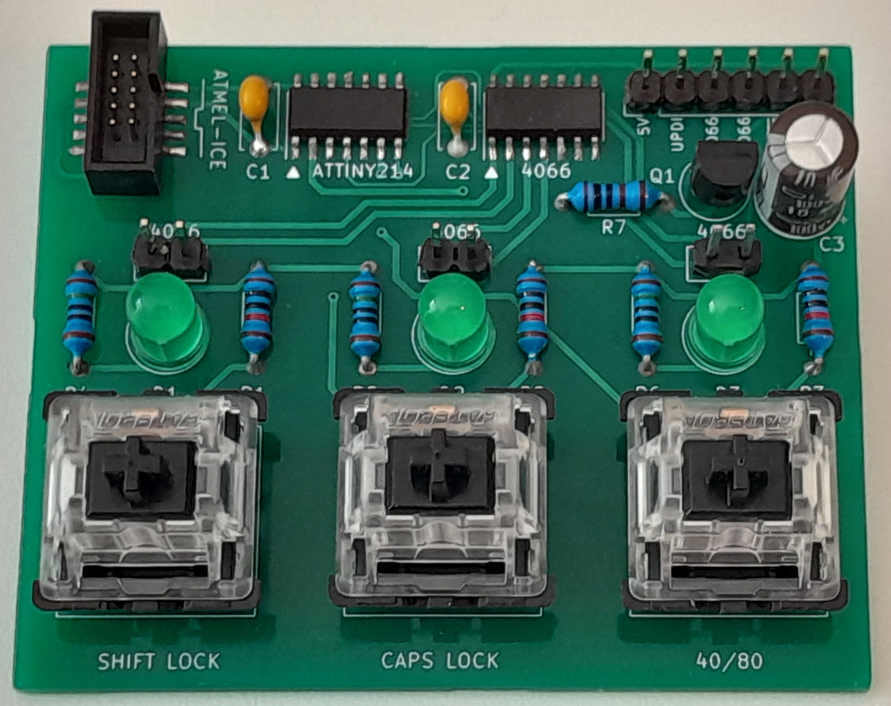

# MXLock

MXLock is a two-chip circuit that allows up to four mechanically locking keys (push-on, push-off) to be simulated using regular momentary key switches.

Many older computer keyboards have mechanically locking keys.  For example, the Commodore 128 has three locking keys: `SHIFT LOCK`, `CAPS LOCK`, and `40/80`.  The MXLock circuit can be included on the PCB of replacement keyboard projects, such as those using Cherry MX keys, so that the entire keyboard can be made from momentary key switches.

Features:

 - Simulates up to 4 locking keys using an [ATtiny214/414/814](https://web.archive.org/web/20231029180615if_/https://ww1.microchip.com/downloads/en/DeviceDoc/40001912A.pdf) and a [4066](https://web.archive.org/web/20231029180910if_/https://www.ti.com/lit/ds/symlink/cd4066b-mil.pdf)
 - Shows the on/off state of each key with LEDs
 - Remembers the lock states between power cycles (useful for mode keys like `40/80`)
 - Resets the computer by pulling `/RESET` low if a key is held down

## Hardware

The [`hardware/`](./hardware/) directory in this repository contains the schematic and a PCB layout for the demonstration board pictured above.  It can be used to test the MXLock circuit.

The circuit is intended to be integrated directly onto the PCB of a keyboard.  Steve Gray's [C128SX keyboard](http://6502.org/users/sjgray/projects/mxkeyboards/) is an example of a keyboard using the circuit.

## Firmware

The firmware is written in AVR assembly language.  It can be assembled and flashed using open source software and inexpensive hardware.  See [`firmware/`](./firmware/) for the source code and instructions.

## Other Circuits

A circuit to simulate locking keys with momentary ones is not a new idea.  Here are some others:

 - [Johan Grip](https://github.com/jgrip/c128-keyboard) uses three [MAX16054](https://web.archive.org/web/20231025162549if_/https://www.analog.com/media/en/technical-documentation/data-sheets/MAX16054.pdf)s and a [74AUC1G66](https://web.archive.org/web/20220804180205if_/https://www.ti.com/lit/ds/symlink/sn74auc1g66.pdf) for the `CAPS LOCK`, `SHIFT LOCK`, and `40/80` keys on the C128.

 - [MtnBuffalo](https://www.breadbox64.com/blog/the-mechboard64/) uses a [555](https://web.archive.org/web/20231103200645if_/https://www.ti.com/lit/ds/symlink/lm555.pdf) and a [4066](https://web.archive.org/web/20231029180910if_/https://www.ti.com/lit/ds/symlink/cd4066b-mil.pdf) for the `SHIFT LOCK` key on the C64.

MXLock differentiates itself by its low parts count (two chips for four keys) and its ability to remember the lock states between power cycles.

## Author

[Mike Naberezny](https://github.com/mnaberez)
